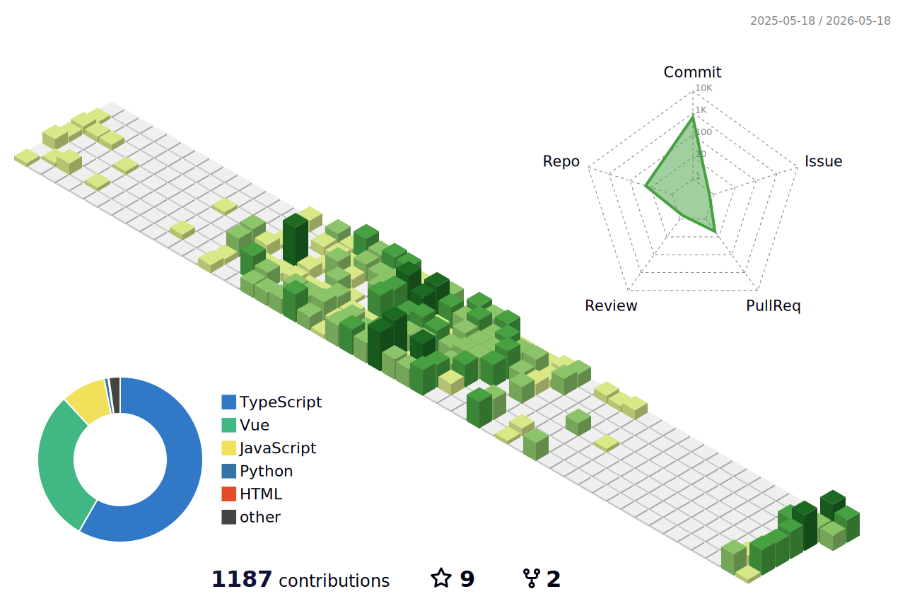

<h1 align="center">Hi 👋, I'm HeartBeat Yonder</h1>
<h3 align="center">A passionate full-stack developer from China</h3>

- 🌱 I’m currently learning **Full-stack development**

- 💬 Ask me about **Vue, React, Node.js, TypeScript, and full-stack projects**

- 📫 How to reach me **3134846106@qq.com**

- 📄 Know about my experiences **Focused on building modern full-stack applications from frontend to backend**

- ⚡ Fun fact **I enjoy turning ideas into complete products**

<h3 align="left">Languages and Tools:</h3>

  &nbsp;&nbsp;
  &nbsp;&nbsp;
  &nbsp;&nbsp;
  &nbsp;&nbsp;
  &nbsp;&nbsp;
  &nbsp;&nbsp;
  &nbsp;&nbsp;
  &nbsp;&nbsp;
  &nbsp;&nbsp;
  &nbsp;&nbsp;
  &nbsp;&nbsp;
  

  
  &nbsp;&nbsp;
  

  

